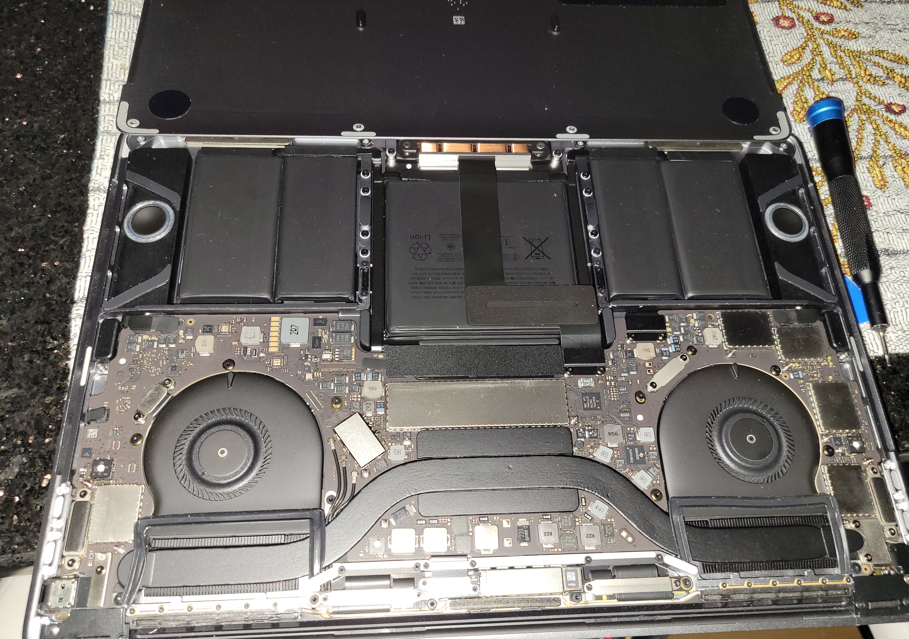

# What is this about?

I have been requested not long ago to repair a laptop from e-waste for a peer. The laptop? A MacBook Pro from 2017. The issue? A firmware lock.

This is the first time I have ever attempted to crack a firmware lock... and it was also one of the harder models to crack.

The MacBook Pro is from the lineup of models with the T1 chip. As you know, the T1 chip is a security chip made by Apple to handle Secure Boot, Touch ID, Apple Pay, etc. Part of the fuel of the fire which is Apple's closed ecosystem, which if you are familiar with Apple's methodology, is quite tight. Making it a difficult nut to crack.

Looked online, found a bunch of SPI EEPROM tutorials, etc etc.

Tried Apple's official tools and had zero luck. I tried just about every single recovery method in the book. Nope, didn't work. I tried DFU... Wait... T1 MacBook Pros don't even have DFU.

(Yeah, I've tried all of them. Didn't even show up in Apple Configurator 2)

Decided instead to do a BIOS dump and reverse engineer the BIOS myself.

# Opening up the bad boy

Alright, I pry this MacBook open. Look inside, and it looks like alien hardware. Completely unlike what I am used to working with (Mostly older PCs)



Okay. I admit. The original reason I did this was because the firmware lock was so invasive, I had my doubts I was actually turning the machine off.

Apparently MacBook Pro batterys are connected to the motherboard by this bendy metal thing hidden below the covers (The cover is that black thing right underneath the battery). Not the typical plug n play commonly found in PCs.

So I unscrewed that, and then finally pulled away the battery plug.

I held the power button to drain the capacitance. Then I tried those same methods as earlier with no luck (power on while holding random keys, unplug, drain capacitance, repeat).

Here's a quirk. When a MacBook Pro from this generation has a firmware lock and is running on charger only... You need to press the power button more than once to turn it on.

Asked my peer if they didn't mind the risk of bricking the laptop. They didn't. So I dug right in.

# Finding the EFI Module

Alright, so the game plan is to find the EFI chip, extract a BIOS dump, crack the firmware and reflash the BIOS. Sounds simple on paper, right? But there's a lot that needs to happen.

First, I needed to find out where the EFI chip actually was. What did I do? I went on schematics and boardviews for the exact Mac Model.


A glimpse at the blueprints (Just did Ctrl+F for "EFI") and we found the Part ID of chip. The ID is U6100.

If you don't know how to interpret IDs, here's a quick tip. R are Resistors, C are Capacitors, L are inductors, D are diodes, Q are Transistors, and *U are specialized components* (the big black squares on the motherboard).

Next step. Where is Part U6100? That is where the boardview comes in.

It was a .brd file. Which posed another issue. But then I found [OpenBoardView (Thanks a lot!)](https://github.com/OpenBoardView/OpenBoardView).

Pulled up the chip's location on the board and...


It's on the other side of the board. The one that isn't facing you when you first open up a MacBook Pro.

Which means, I had to actually take the logic board out of the computer. Thankfully it's not too difficult, just need to remove like 20 screws and unplug as many connectors as possible.

I will mention this. One of the connectors is glued onto the board. It's glued because it's attached to a hard part that sticks onto the board. Please try to take out that connector from the board when you unplug it. It is very small and fragile. It's called the "Mesa Connector" and it's really important since it has TouchID and especially because it connects to the button which is required to *TURN ON THE COMPUTER*. Learned it the hard way. So please don't try to break it. (Even though replacements are like 30$.)

Alright, I removed the board.


(In the picture you can see the bendy thing at the top that connects to the battery that I mentioned earlier)

Now I have to find the chip on the actual board. This is easy since I had the boardview, schematics, and already taken the board out.

It's right here.


You see it? It's the chip that says "Winbond 25Q64FVIQ". That's the EFI chip. It has 8 pins on the output as well.

It checks out with what I saw in the schematic.

Here's the pinout (it's basically the same for all models just the shape of the pins are different)


The fun part is about to commence...

# BIOS Dumping Time, or is it?

Recently got my SOIC8 chip clip in the mail. Also got a Raspberry Pi for me to do the actual BIOS flashing. (Will use a Pi that I already have, mind you.)

Alright, just need to map this pinout to that of my Raspberry Pi. The VCC pin has a supply voltage range of –0.6 to 4.6V. The operating range is between 2.7 and 3 V for some frequencies, and 3 and 3.6 V for others. The datasheet says this is a 3V EFI chip. I have no clue what frequency I will use.

Okay. MAYBE I could use a voltage divider to get exactly 3V for safety, but nah, screw it. Gonna use the 3.3 V output from the Raspberry Pi.

Alright the Ground is easy. But the rest is gonna be a while to figure out. (Just google raspberry pi pinout of whatever model you have)

In the meantime, will install the necessary tools like flashrom on the Pi.

But back to the chip clip! Make sure that the dot on the chip aligns with the colored wire, because the dot and colored wire both correspond to Pin 1, and they go counter clockwise the pins!


The chip clip is attached but I have my doubts I'm even doing this correctly. Look at the size difference between the chip clip's attachments and the chip. Might need mechanical adjustments to make this work. But let's see if this will do for now.

Time for the BIOS dump! (if my setup actually works)

# Pre-Pre-Dump

I'm sorry to surprise you. But before I use the MacBook, I tried a Thinkpad.

I needed a quick way to test the system, and apparently I was able to dump the BIOS of an older Thinkpad using Raspberry Pi and flashrom.

The chip topology of the Thinkpad's chip makes it easier. No need to solder unlike the Mac. However, I will try the Mac anyways just in case. It means,,, perhaps there is still hope after all.

I quickly got the gist of BIOS firmware dumps (You have to do it like 4 or 5 times because the checksums may be different. Also pinouts are basically the same between different EFI chips.)

# Pre-Dump

First of all, the chip clip did not connect to the chip. The pins of the chip were too deep inside.

My next plan was to solder the tips of the chip clip for better grip on the chip. I soldered little spikes to the end. However, apparently this did not suffice.

The next step was to actually remove the chip. What did I do? I used a hot air station (NOTE: PLEASE DON'T TRY THIS AT HOME)

After applying 200 degrees of hot air repeatedly to the chip (enough to melt like half the label), I was able to remove the chip.

But here's the issue.


The PCB has been messed up... Also...

The chip apparently was difficult to remove because of that big metal in the middle. It had a huge ground "belly" that made it difficult to put it on a breakout board the traditional way (Yes, we tried it, it slid on the breakout board), and needed an improvise. (This is just Apple being apple, choosing a form factor that wasn't even in the official datasheet for that chip.)

Honestly, I knew it was gonna be there from the boardviews, but I didn't know it was gonna be this big.

We soldered it into the breakout board upside down. (I used 'we' because I needed some help with such precise soldering, It was so difficult NOT to bridge something by accident)


I plugged it into the Raspberry Pi, trying to map the pinouts the best I could (since it was upside down it posed a bit of a challenge) using the datasheet. Then that part was completed. I was ready to dump the firmware. Or at least I thought...


I kept trying, changing the plugs, double checking everything. It wasn't working, and I was wondering why.

I tried just about everything. I even thought I broke the chip. My heart nearly sunk in despair.

Until...

I took out the soldered breakout board and started to fiddle with the wires connecting it. I found a cold joint at the CLK pin (which is very important for SPI interfacing). I knew the chip worked since it was receiving power, but this was the issue.

I quickly soldered the cold joint and then put the chip back in. In anticipation, I went to my Raspberry Pi and typed the command:

```flashrom -p linux_spi:dev=/dev/spidev0.0```

and the result?

```Found Winbond flash chip "W25Q64.V" (8192 kB, SPI) on linux_spi.```

The moment of truth has arrived.

# Disclaimer

Apparently I found out about JTAG debugging and should have done that in hindsight, but JTAG debuggers are expensive and hard to source. If you can source a JTAG debugger it means you don't have to solder or work with really hot stuff. Plus, chances are it's much easier if you come from a software background.

# The Moment of Truth

It was time for me to dump the firmware.


Super happy with how it came out.

I dumped the firmware 5 times in total.


It was miraculous. The checksums for all 5 dumps I did matched, and I dumped them with different speeds and configurations. I have attached two of them in the ```dumps``` folder here.

By the way, the SHA256 Checksum of the Bios Dump is ```a999a4b807fa95844a6235fdbaa5203d7c2b604e10c0288e53d20c4df62ad21c``` if you do want to download the file.

The next step will be a whole different game... to reverse engineer and redump the BIOS.

See y'all next time >:)

# Reverse Engineering the BIOS

Now here's the next step. The step actually involves reverse engineering the firmware in order to remove the BIOS lock. Before we get to that, let me point out some interesting observations about Apple firmware.

First of all, there is Apple metadata all over it. One of the last lines is \__AAPL__ which you may recognize it as Apple's Stock initial.

There's also this.


Found way more interesting and cool stuff buried in the firmware dump just by typing ```strings bios_dump.bin``` into my terminal. I have pictures. But I don't want clutter the doc by sharing those here.

It's time for the next step... a Hex Dump analysis.

For the Hex Dump, I am using HxD on a Windows 7 laptop. Pretty old but gold tech. I do need to understand the dump and so I can find and clear the firmware lock in there. But first, I want to go on a little tech adventure.

Here are some interesting things that I found.


Here you can see the Device ID and the language the computer was set to... The latter isn't commonly found in BIOS Dumps.


Here you can see the location of the boot.efi in the MacBook. Which allows the Mac to boot. There is also the part where the Audio / Video of the system is initialized.

There is a lot more cool stuff I found here, like the initialization of NVRAM, NVMe Drive (which is Soldered into the logic board), and even stuff that you don't normally see in BIOS dumps like Device Name, known Wi-Fi networks, (these two things are most likely part of Apple's T1 Ecosystem) and much more.

And yes... You see a lot of periods between letters, as in ```S.y.s.t.e.m``` in this type of Mac BIOS. They are actually not periods but null characters. It may be because of how the firmware is interpreted in the system, but I wouldn't be surprised if this was Apple's other attempt to lock things down further.

# Cracking the Password

However, the goal is to crack the firmware password on Apple device, which has been done before. To do that we need to compare the hex files of locked and unlocked firmwares.

I downloaded multiple samples of examples of cracked firmwares of MacBooks and then ran this command on them:

```cmp -l firmware_locked.bin firmware_unlocked.bin  | awk '{printf "0x%08X 0x%02X 0x%02X\n", $1, strtonum("0x"$2), strtonum("0x"$3)}' > hex.txt```

I also did this command for the two Thinkpad Firmwares I extracted, since two of them had different SHA256 checksums. (The real vs the fake)

I checked the first Hex Offset from the result of the Lenovo firmware comparison on both dumps (hex.txt). When I got to the offset in HxD on both firmwares, I realized the offset produced by the Linux command was off by 4 bits. Which is not bad at all.


Now it's time for me to do this with the MacBook locked and unlocked firmwares, so I can find where is the password on my firmware.

After exploring MacBook Firmware Dumps and the password locations, I have found the hex offset of the Firmware lock.

The firmware lock is at around position 0x0015B05X (Row 0015B050 in HxD). In the text it should begin with ```$SVS°```

The next step is to clear what comes afterward with F's in Hex. The question is. How much after the $SVS should I start clearing, and when should I end? Because the start of the clearing is different on every firmware dump. But based on the information I am seeing, the Unique data starts at 0x0015B080 (beginning of Row 0015B080) so I will probably clear starting there. I will also double check if there are more places I should clear, because that row is the first place to clear.

Did the math, one of the dumps has cleared 0x125A bytes. One of the dumps has cleared 0x800 bytes. Another dump has cleared 0xC28 bytes. For safety, I will clear 0x800 bytes (this is 2048 in decimal). It means I will end the clear at 0x15B880.


Here's something interesting. Immediately after the $SVS, while clearing the password, and even after my clearing, I keep seeing this repeated sequence of characters: ªU|���€"��� ���^§öUpN´§·¥·Xê*XXXX* (The last four digits are four random bits.) I wonder if this is how the firmware password is encrypted, and how do I decrypt it. I am considering getting a T1 Mac and firmware locking it with an easy password just so I can decipher the code ;)

At the end of the sequence appears "M.e.m.o.r.y.C.o.n.f.i.g.H.a.s.h." and then a whole blank. That's another interesting thing.

Well... I hope that clearing was enough. Because the next step is to verify and then flash the modified firmware back into the chip.

# Verification

Quick skim thru the file by cmp... Looks like I didn't accidentally change anything stupid. The sha256 checksum did change though, which is to be expected. I also noticed I cleared less bytes than I anticipated. I did 1936 instead of 2048. Oh yeah... That's because I made the mistake of stopping at *0x15B810* instead of 0x15B880. It should... be fine though.

The final phase is to inject the modified firmware into the chip. Then test it. Thankfully injecting is the easy part.

# Reflashing the firmware
